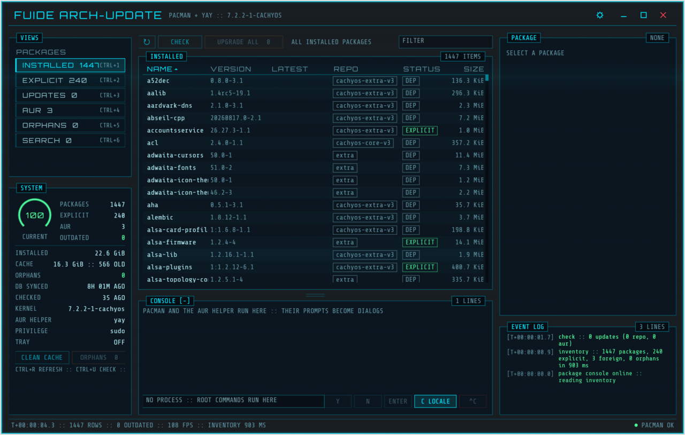
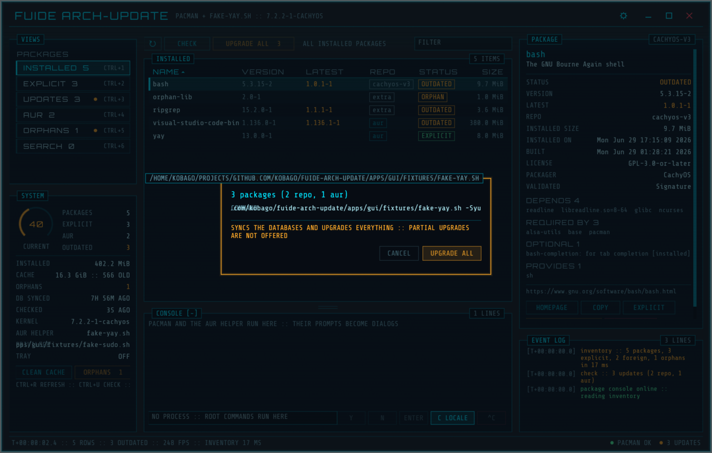

# FUIDE Arch-Update — pacman / AUR のパッケージマネージャ + 更新監視トレイ (FUI)

Arch Linux (CachyOS など) 向けのデスクトップ用パッケージマネージャです。[fuide](https://github.com/kobago/fuide) (egui 0.36 向けの FUI テーマ・窓シェル・部品) の上に作ってあり、[fuide-brew](https://github.com/kobago/fuide) と同じ構成 (左: ビュー / システム、中央: 一覧 + コンソール、右: 詳細 / ログ) です。

- **GUI `fuide-arch-update`** — インストール済み / 明示 / 更新 / AUR / 孤立 / 検索の 6 ビュー、パッケージの詳細、インストール・削除・全体更新・明示/依存の切替・孤立削除・キャッシュ掃除。root が要る操作は **pacman / AUR ヘルパーをそのまま疑似端末 (pty) で実行**し、`sudo` のパスワードや pacman / yay の質問を FUI のダイアログに変換します
- **トレイ `fuide-arch-update-tray`** — StatusNotifierItem。一定間隔で `checkupdates` + `yay -Qua` を実行し、アイコン (シアン = 最新 / アンバー + 点 = 更新あり / 赤 = チェック失敗) とメニュー (更新一覧、最終・次回チェック、Open / Upgrade now / Check) を更新。新しい更新が見つかると通知 (Open / Upgrade now アクション付き)。GUI とは状態ファイルを共有するので、GUI で更新するとトレイもすぐ「最新」になります





## 構成

```
crates/archpkg/   pacman / AUR ヘルパーの読み取りクエリと出力パーサ (-Qi / -Si / -Ss / checkupdates / -Qua)、GUI とトレイが共有する状態ファイル
apps/gui/         fuide-arch-update  (egui + fuide。pty ランナー、VT100 サブセット、プロンプト検出、テスト用の偽 pacman / yay / sudo)
apps/tray/        fuide-arch-update-tray  (ksni + tokio + notify-rust)
res/              .desktop 2 つとアイコン
pkg/PKGBUILD      fuide-arch-update-git
```

方針: **システムを変える操作は全部 pacman / ヘルパーのコマンドをコンソールで実行する** (libalpm への直接アクセスはしない)。パッケージ DB の扱いは pacman 本体に任せ、GUI は読むだけ。部分アップグレード (`-Sy` + 個別 `-S`) は出さず、更新は常に `-Syu` (ヘルパーがあれば `yay -Syu`、無ければ `sudo pacman -Syu`)。AUR パッケージ単体の更新はヘルパーの `-S <pkg>`。

## 画面

- **VIEWS** — INSTALLED / EXPLICIT / UPDATES / AUR / ORPHANS / SEARCH (Ctrl+1..6)。更新と孤立には注意色の点
- **SYSTEM** — 最新率ゲージ、パッケージ数 / 明示 / AUR / 更新、インストール容量、キャッシュ容量 (`paccache -dk2` の候補数)、孤立、DB 同期時刻、最終チェック、カーネル、AUR ヘルパー、権限昇格コマンド、トレイ稼働。`CLEAN CACHE` (`paccache -rk2`)、`ORPHANS n` (`pacman -Rns`)
- **ツールバー** — 再読込 (Ctrl+R)、`CHECK` (Ctrl+U: `checkupdates` + `-Qua`、状態ファイルに書く → トレイに反映)、`UPGRADE ALL n`、フィルター (Ctrl+F)。SEARCH ビューでは検索欄 + `SEARCH` (`pacman -Ss` + `yay -Ss --aur`。同名はリポジトリ優先、インストール済みは在庫の情報をそのまま表示、未導入のものは選択時に `-Si` で詳細を取得)
- **一覧** — NAME / VERSION / LATEST / REPO / STATUS (OUTDATED / ORPHAN / EXPLICIT / DEP / AVAILABLE) / SIZE。列見出しでソート、ダブルクリックでホームページ
- **CONSOLE** — pacman / ヘルパーの端末 (色付き、コピー可)。入力行と `Y` / `N` / `ENTER` / `^C`。`C LOCALE` = コマンドを `LC_ALL=C.UTF-8` で走らせる (既定 ON。プロンプトが英語になり確実にダイアログになる。日本語の `[sudo] … のパスワード:` と `[Y/n]` は OFF でも認識)。帯のドラッグで高さ変更、チップで折りたたみ (保存)
- **PACKAGE** — 説明、状態、版 / 最新、repo、容量、導入日、ビルド日、ライセンス、グループ、パッケージャ / メンテナ、AUR の票数 / 人気 / out-of-date、DEPENDS / REQUIRED BY / OPTIONAL / PROVIDES / CONFLICTS。`HOMEPAGE` / `COPY` / `EXPLICIT` ↔ `AS DEP` (`pacman -D`)、`UPGRADE` (AUR) / `UPGRADE ALL` / `REMOVE` (`-Rns`、危険色) / `INSTALL` (`-S --needed` または `yay -S`)
- **EVENT LOG** — アプリ側の出来事
- **ダイアログ** — 変更系は必ず確認 (コマンド行を表示)。実行中は `[Y/n]` → YES/NO、`[sudo] password` → 伏字入力 (ログにも設定にも残さない)、yay の `Diffs to show? … or (1 2 3, 1-3, ^4)` → テキスト入力、`Enter a selection (default=all)` → テキスト入力、番号選択 → チェックボックス一覧。認識できないものは入力行で。終了コード 0 で `SUCCESS`、それ以外は `ERROR` カード。終了後は在庫を再読込して再チェック

| 操作 | キー |
|---|---|
| ビュー | Ctrl+1 … Ctrl+6 |
| 再読込 / チェック / コンソール消去 | Ctrl+R / Ctrl+U / Ctrl+L |
| フィルター (検索ビューでは検索欄) | Ctrl+F、Esc でクリア |
| 選択行のホームページ / 削除 | Enter / Ctrl+Backspace |
| ダイアログ | Enter = 主ボタン、Esc = 取消 (プロンプトはコンソールの入力行に任せる) |
| 設定ウィンドウ | Ctrl+, または歯車 (パレット CYAN / AMBER / GREEN、角、密度、透過、エージェント) |
| 終了 | Ctrl+W (実行中のコマンドは止めない) |

## トレイ

```
fuide-arch-update-tray [--interval SECS] [--no-initial-check]   # 既定 3600 秒、起動 20 秒後に初回チェック
```

- 左クリック = GUI を開く。メニュー: `N updates available` → GUI、Repositories / AUR のサブメニュー (項目をクリックすると GUI がそのパッケージを選択して開く `--select`)、`Last check` / `Next check`、`Open …`、`Upgrade now…` (GUI を `--upgrade` で開く = 全体更新の確認ダイアログから始まる)、`Check for updates`、`Quit`
- 通知: 前回のチェックに無かった更新が見つかったときだけ。`Open` / `Upgrade now` アクション
- 状態ファイル `~/.local/state/fuide-arch-update/check` を GUI と共有 (両方が書く。トレイは変更を監視して即反映)
- アイコンはコードで描く ARGB ピクスマップ (アイコンテーマ不要)。同じ図形が `res/fuide-arch-update.svg`
- 1 セッション 1 インスタンス (`$XDG_RUNTIME_DIR` のロック)

## ビルドと導入

```sh
sudo pacman -S --needed cargo pacman-contrib      # checkupdates / paccache
make && sudo make install                          # /usr/local/bin/fuide-arch-update{,-tray} + .desktop + アイコン
make enable-tray                                   # 任意 (root 不要): ログイン時にトレイを自動起動 (~/.config/autostart)
```

`pkg/PKGBUILD` (`fuide-arch-update-git`) もあります (`cd pkg && makepkg -si`)。

`fuide` クレートは非公開リポジトリから ssh で取得します (`Cargo.toml` の git 依存 + `.cargo/config.toml` の `git-fetch-with-cli`)。手元の checkout を使うなら `~/.cargo/config.toml` に:

```toml
[patch."ssh://git@github.com/kobago/fuide.git"]
fuide = { path = "/home/you/projects/github.com/kobago/fuide/crates/fuide" }
```

## 開発

```sh
cargo run -p fuide-arch-update           # 実物の pacman / yay を読む (操作するまで何も変えない)
cargo run -p fuide-arch-update-tray -- --interval 300
cargo test                               # パーサ / 状態ファイル / 端末 / pty / プロンプト / アプリの状態機械 / E2E (egui_kittest)
cargo clippy --all-targets -- -D warnings

# 偽のツールチェーンで一通りの流れを見る (システムに触らない)
F=$PWD/apps/gui/fixtures; FUIDE_ARCH_PACMAN=$F/fake-pacman.sh FUIDE_ARCH_AUR_HELPER=$F/fake-yay.sh \
  FUIDE_ARCH_SUDO=$F/fake-sudo.sh FUIDE_ARCH_CHECKUPDATES=$F/fake-checkupdates.sh \
  FUIDE_ARCH_STATE_DIR=/tmp/fau-state FAKE_SLOW=1 cargo run -p fuide-arch-update
```

| 環境変数 | 意味 |
|---|---|
| `FUIDE_ARCH_PACMAN` / `FUIDE_ARCH_AUR_HELPER` (`none` = 無し) / `FUIDE_ARCH_SUDO` / `FUIDE_ARCH_CHECKUPDATES` / `FUIDE_ARCH_PACCACHE` | 実行ファイルの差し替え |
| `FUIDE_ARCH_STATE_DIR` / `FUIDE_ARCH_SYNC_DIR` | 状態ディレクトリ / 同期 DB ディレクトリの差し替え |
| `FUIDE_CONFIG_DIR` | fuide 設定ファイルの置き場所 |
| `FUIDE_SCREENSHOT=/path/shot.tga` (`FUIDE_SCREENSHOT_FRAME=45`) | N フレーム後に撮影して終了 |
| `FUIDE_DEV_DIALOG=install\|remove\|upgrade\|password\|abort\|error\|success`, `FUIDE_DEV_SEARCH=q`, `FUIDE_DEV_SETTINGS=1 FUIDE_DEV_EMBED=1` | 撮影用フック |
| `FAKE_UPDATES=n` / `FAKE_AUR_UPDATES=n` / `FAKE_FAIL=1` / `FAKE_SLOW=1` | 偽ツールチェーンのつまみ |

AI エージェント (MCP) から操作する: 設定ウィンドウで `MCP SERVER: ON` にして `fuide-arch-update --mcp` を MCP クライアントに登録 (fuide の README 参照)。パスワード入力と (既定では) 確認ダイアログの実行ボタンは人間に留保されます。
